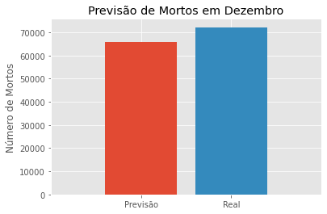
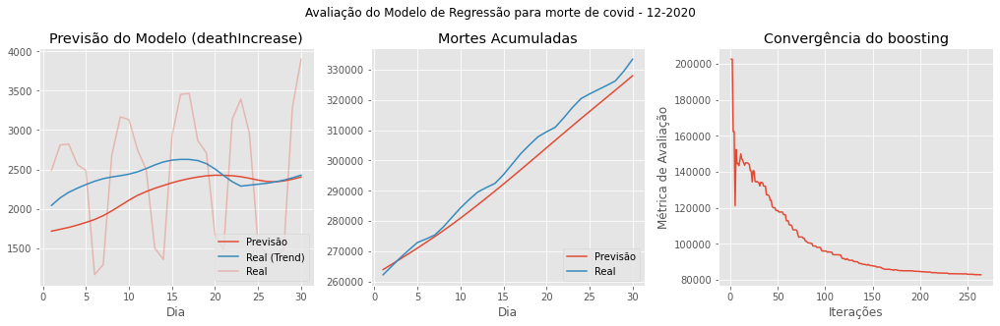

O projeto consistiu em produzir módulos, scripts, notebooks para as tarefas de análise exploratória e modelagem preditiva do número de mortes pela COVID em 2020.

Os dados oferecidos são acessados pela api:

* COVID TRACKING: https://api.covidtracking.com 
    - Valores históricos: /v1/us/daily.csv
    - Meta dados dos Estados: /v1/states/info.csv
    - Valores históricos para Estados: /v1/states/{state}/current.csv
   
Além desses, foram também consultados:

* POPULATION ESTIMATES API: https://api.census.gov/data/2019/pep/population
    - Consulta a estimativas populacionais nos EUA.

# 1. Ferramentas Utilizadas

Além dos já citados acima, foram também resultados desse projeto, além do seu objetivo principal, o desenvolvimento de duas aplicações:

## A classe ApiManager

> `resources.io.api_manager.ApiManager`

---

LOCALIZAÇÃO 

    .resources/
        |__io/
            |__api_manager.py

Esse modulo oferece uma classe `ApiManager` que automatiza as *requests* às APIs, o gerencimento dos diretório onde os dados serão armazenados ao mesmo tempo que oferece rapido acesso a eles.

DESCRIÇÃO

A classe efetua essas atividades automáticamente, requerindo apenas o input de um arquivo de configuração no formato YAML que pode ser editado manualmente ou gerado por *helpers* contidos mesmo módulo.

## A classe DataframeTransformer

> `resources.processing.transformers.DataframeTransformer`

---

LOCALIZAÇÃO

    .resources/
        |__processing/
                |__transformers.py

DESCRIÇÃO

Este módulo permite construir pipelines de transformação em datos estruturados (dataframes). Nesse projeto ele foi utilizado para fazer pipelines de processamento dos dados buscados na API convertidos para pandas dataframes.

Foi pensado em ser versátil e prático e por isso ele é capaz de utilizar com facilidade funções customizadas para integrar o pipeline.

## Scripts
---

Os scripts desenvolvidos são únicos para esse projeto e tem como objetivos:

* Coletar dados via API
* Processar e alimentar dados para análises
* Criar datasets (treinamento e retenção)
* Treinar e avaliar modelos preditivos

        .scripts/
            |__retrieve-data-nb01.py    # coletar dados do covid
            |__retrieve-data-by-states.py   # coletar dados por estados
            |__retrieve-data-census.py  # coletar dados demográficos
            |__processing_data_by_states.py     # preparar dados para EDA
            |__make_datasets.py     # construir `traininig` e `test` sets
            |__training.py      # trainer modelo de regressão
            |__model_evaluation.py  # Calcular previsão e métrica para o `test_set`

O processo de captura, processamento, treinamento e dumping do modelo é todo realizado pela execução dos scripts na sequência apresentada.

* Acessar `--help` do script informa sobre inputs necessários para rodá-los.

## Notebooks
---

Os notebooks se encontram na raiz do repositório e foram utilizados para *análise exploratória* (EDA), vizualização e avaliação do modelo.

A análise exploratória dos dados nesse projeto teve como foco primário estudar as variáveis acessíveis na COVID TRACKING API e definir estratégias para modelagem preditiva. Nesse escopo encontram-se atividades de visualização, tratamento, engenharia de atributos, análises estatísticas e de mineraçao.

* `01_exploração_inicial.ipynb`
    
    Esse notebook investiga as características da séries temporais das variáveis relacionadas à epidemia da covid. Define a melhor variável alvo com seus possíveis preditores, além de investigar tratamentos nos dados visando ganhos no modelo preditivo.

* `02_EDA_avancada.ipynb`

    O foco deste notebook é visualização e mineração para definição de estratégias para o modelo preditivo. Foram empregadas técnicas e/ou algorítimos para decomposição espectral das séries temporais e clusterização para detecção de anomalias. A mineração se voltou para buscar perfis regionais de evolução da covid no território americano com essas técnicas.

* `03_Avaliacao_regressao.ipynb`

    Este é um notebook dedicado para visualização dos resultados/previsões do modelo nos dados de teste.

    Aqui foram  exploradas tanto as taxas de mortes diárias como acumuladas ao longo do período de teste.

## Outros
---

Diretório `./config`
> Aqui ficam armazenados os arquivos YAML utilizados pela classe `ApiManager` para coletar e gerenciar os dados oriundos das API configuradas por ele.

Diretório `/data`
> Esse diretório mantém arquivos relevantes a serem consumidos por scripts ou notebooks. Ao contrário do `./cache` que não é versionado.

Package `resources`
> Envelopa as principais funções e módulos necessários no projeto por funcionalidade.

# 2. Análise Exploratória – EDA
## Sumário Executivo

* Inicialmente os dados foram avaliados quanto a sua dispoibilidade, e considerando a *concentração de null* com o processo de aderência dos estados em reportar seus dados relativos à covid foi concluído que os dados de  janeiro, fevereiro e março devem ser descartados pois a sua representatividade da situação da covid pode ser questionada.

* Foi decido que a modelagem preditiva seria mais beneficiada se fossem utilizadas taxas de variação (como aquelas sufixadas por *Increase*) e portanto a tarefa de regressão ideal seria a previsão da variável `deathIncrease`. Isso, contudo, apresenta desafios pois esta possui um comportamento cíclico característico.

* Com a modelagem da séries de dados `deathIncrease`, representando a taxa de mortes, baseada na *seasonal trend decomposition* foi possível obter uma suavização com pouquíssima perda de informação em relação ao dados brutos quando comparada aos dados do campo de *mortes acumuladas*. A análise das oscilações indica que elas derivam mais do processo de registro de dados do que do fenômeno da covid. 

Com a nova curva representativa da taxa de mortes, foi avaliado como a série se relacionada com as outras variáveis do dataset e a capacidade preditiva destas.

Desse modo, inspirado na função de autocorrelação, foi avaliado qual a defasagem, ou quantos *lags* havia entre a taxa de mortes e as demais variáveis (em formas de taxas) de modo a maximizar o coeficiente de Pearson entre elas. Houve resultados promissores.

    [inIcuCurrently...........] Linear Corr (0.820) maximizado para lag => 00
    [hospitalizedCurrently....] Linear Corr (0.616) maximizado para lag => 11
    [hospitalizedIncrease.....] Linear Corr (0.808) maximizado para lag => 10
    [positiveIncrease.........] Linear Corr (0.401) maximizado para lag => 31

`hospiralizedIncrease` e `positiveIncrease` apresentaram capacidade modesta à boa de previsão da taxa de mortos. No geral, as variáveis apresentam uma proximidade entre suas séries temporais e existe a possibilidade de modelos de regressão linear serem aplicados. Mas ainda a melhor forma de serem aplicados é um ponto a ser investigado. Como esses dados são nacionais eles podem estar escondendo aspectos locais, que por conta de não serem aproveitadas no treinamento do modelo, podem prejudicar sua performance.

Essa exploração inicial pode também estabelecer técnicas e ajustes a serem utilizados em um conjunto de dados maior. Esses detalhes foram aproveitados e aperfeiçoados em scripts para prover dados a análises mais detalhadas.

Primeiramente, a partir da seleção anterior da variável *taxa de mortes* por covid (`deathIncrease`) para cada estado, é feita a decomposição da parte sasonal da série, e os valores da *trend* são transformados no índice *taxa de mortes por cada 100.000 habitantes* para amenizar os efeitos da diferença populaiconai entre os estados que há nos dados absolutos. 

A decomposição espectral do dataset de séries *individuais* por estados vai fornecer um conjunto menor de séries que apresentam características *compartilhadas* por todos os estados. Cada uma dessas séries será chamada de **compontes principais** e elas podem fornecer atributos com os quais os estados podem ser avaliados entre si.

No dataset presente, a decomposição em 4 componentes já representou ~95% de toda a variância do dataset.

Ambos, componentes e clusters (em análise realizada posterioremente), indicam que os estados divergem quanto ao ínicio da pandemia, mas em meados do fim de ano as componentes são muito parecidas.

À excessão se faz pela componente 2, que está ligada a estados que diveram uma forte alta de casos de covid no período em que o modelo será avaliado. A imagem abaixo ilustra a disposição dos estados para cada uma das componentes. 

A *componente 2* merece mais destaque foi indica diretamente estados que tenderam ao crescimento das mortes por covid de forma independente aos demais.

Ao analisar a componente 2, observou-se que seu efeito é muito localizado em uma região com pouco peso populacional nos EUA, então não estará pesando fortemente na taxa de mortes nacionais.

**BOTTOMLINE**

O comportamento do covid nos eua evoluiu para um estado em que o comportamento da pandemia é similar mesmo em regiões geograficamente afastadas. 

O período inicial dos dados será descartado pois nesse período o estados apresentam séries bastantes dispersas. A partir destas informações já é possível desenhar modelos preditivos e de *forecasting* basedos nestes dados. Opções são utilizar a própria autocorrelação das séries nacionais em modelos autoregressivos como ARIMA ou utilizar utilizar os preditores encontrados.

# 3. Modelo Preditivo

O modelo preditivo tem como alvo a previsão do número de mortes devido a COVID e usará os preditores encontrados durante a análise exploratória dentro do algorítimo de regressão (OLS). 

Não se observou a necessidade de criar modelos para grupos de estados específicos, apesar de a taxa de mortes nacional ser uma composição das taxas locais, e de os estados terem tido pontos de partidas diversos ao longo de 2020, a tendência tem sido uma uniformização dos efeitos da COVID e as estatísticas nacionais foram utilizadas diretamente na criação do *data set de treinamento e teste* do modelo. 

Os dados foram tratados através das técnicas discutidas anteriormente, a decomposição sasonal (Loess) e a utilização dos *lags* caracteríticos dos preditores. Para a avaliação do modelo foi preparado um conjunto de retenção que incorpora os dados de dezembro (2020). 

*O treinamento do modelo*

A regressão foi implementada com penalização nos seus coeficientes (ridge) e iterações de boosting (AdaBoost). Os hiperparâmetros do modelo foram o parâmetro de regularização $\alpha$ e a *taxa de aprendizado* do algorítmo de boosting. O balanço ideal entre esses parâmetros foi otimização através de validação cruzada e a métrica de avaliação utilizada é o *erro méodio quadrático*.

        $ python ./scripts/training.py -d ./data --print
        
        # output
        Fitting 20 folds for each of 40 candidates, totalling 800 fits
        --------------------------------------------------
        Base Estimator: Ridge
        Penalty (alpha): 100000.0000       
        Cross-validation score: -16348.6088
        Boosting loss function: exponential
        Boosting learning rate: 0.10       
        Boost iterations: 264
        Training Error: 15545.7
        --------------------------------------------------

Os resultados deste modelo contra o conjunto de retenção é gerado pelo script `model_evaluation.py` e a previsão para o número de mortes é mostrado abaixo.

Como pode ser observado, o modelo estima o número de mortes bem próximo ao que realmente ocorreu. O erro medido pela diferença relativa dos valores é de 8.78%.

*A avaliação do modelo*

A avaliação númerica do modelo é medida pela mesma métrica utilizada no treinamento, *erro médio quadrádico* e pode ser obtida diretamente por script próprio.

    $ python ./scripts/model_evaluation.py --metric mean_squared_error --dry

    # output
    Evaluation metric: mean_squared_error
    Test set size: 30
    Evaluation value: 82760.37
    Variance in test set: 20828.11

O script grava os valores previstos, e podem ser acessados depois para análise. Abaixo estão visualizações para uma análise comparative entre a previsão do modelo e os valores reais.

À esquerda é apresentada a previsão junto à variável alvo do modelo (em seu estado original e suavizado). A imagem do centro apresenta o número acumulado de mortes ao longo do mês de dezembro.

Em ambos é visto que o número previsto de mortos é razoavelmente bem aderente a série temporal de dados.

O terceiro e mais afastado gráfico apresenta o efeito da adição de cada iteração de boost medido pela métrica utilizada no treinamento (erro médio quadrádico). O boosting foi capaz de reduzir o erro do modelo significativamente antes de convergir.
